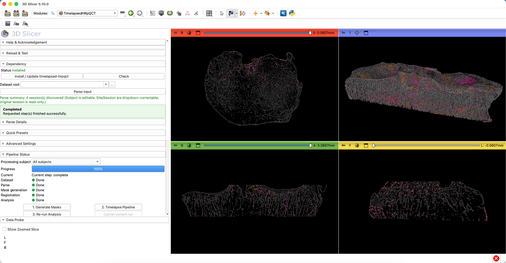

<p align="center">
  
</p>

# TimelapsedHRpQCT Slicer Extension

3D Slicer scripted extension for running and reviewing the `timelapsed-hrpqct` pipeline.

`timelapsed-hrpqct` is a longitudinal high-resolution peripheral quantitative computed tomography (HR-pQCT) analysis workflow that aligns longitudinal scans of the same subject across timepoints and computes remodelling-related outputs from those registered volumes.
It is designed for high-throughput, pipeline-style processing of multi-subject datasets.
It is intended for HR-pQCT datasets acquired on Scanco XtremeCT systems. The current workflow was developed primarily for second-generation XtremeCT data, but can be adapted to other compatible acquisition setups.

## Core Pipeline Repository

This Slicer extension is a GUI wrapper around the main pipeline repository:

- `TimelapsedHRpQCT`: https://github.com/wallematthias/TimelapsedHRpQCT

<p align="center">
  
</p>
<p align="center">
  <em>Example output: HR-pQCT scan of a knee (2 stacks), registered longitudinally, with formation sites in orange and resorption sites in purple. Data kindly provided by Dr. Sarah Manske.</em>
</p>

## Modules

- **TimelapsedHRpQCT**: End-to-end longitudinal HR-pQCT workflow in Slicer.
  - Parses AIM datasets into subject/site/session structure.
  - Generates masks (if needed), runs timelapse registration, and computes remodelling outputs.
  - Loads processed outputs (`raw`, `transformed`, `remodelling image`) for review and 3D visualization.

## Installation

### Option A: Extension Manager (recommended when listed)

1. Open 3D Slicer.
2. Install `TimelapsedHRpQCT` from Extension Manager.
3. Restart 3D Slicer.

### Option B: Developer mode (current fallback)

1. Open 3D Slicer.
2. Go to `Edit -> Application Settings -> Modules`.
3. Add module path:
   - `<repo>/TimelapsedHRpQCTSlicer/TimelapsedHRpQCT`
4. Restart Slicer.
5. Open module `TimelapsedHRpQCT`.

## Tutorial

1. Open module `TimelapsedHRpQCT`.
2. Click `Install / Update timelapsed-hrpqct` to install runtime dependencies in Slicer Python.
3. Select your AIM dataset root.
4. Click `Parse input`.
   - `Parse summary` reports how many sessions were discovered.
   - In `Parse details`, you can correct `site` and `session` values if needed before running.
5. Choose where results should be written:
   - default: `<dataset_root>/TimelapsedHRpQCT_results`
   - optional: set `Results folder` to override.
6. If you do not already have valid masks/contours, click `1. Generate Masks`.
7. Click `2. Timelapse Pipeline` to run the timelapse processing and create remodelling outputs.
8. Load `remodelling image` from `Load Processed Data` and inspect in 2D/3D.
9. If you change analysis settings (for example density threshold or cluster size), click `3. Re-run Analysis`.
10. Use `Load Processed Data` to load different processing stages (`raw`, `transformed`, `remodelling image`) for quick comparison.

## Results Layout

Pipeline outputs are saved in a structured MIDS/BIDS-style folder layout under the results root.

- Default results root: `<dataset_root>/TimelapsedHRpQCT_results`
- Optional override: `Results folder` field in the module
- Typical organization: subject/site/session-based folders with derivative outputs grouped by processing stage

This structure is intended to make results easy to browse, reload in Slicer, and reuse in downstream analysis.

## Input Filename Format

The parser expects AIM filenames that include:

- subject identifier
- site token (`DR`, `DT`, or `KN`)
- session token (for example `T1`, `T2`, `C1`, `BL`, `FL`, `FL1`)
- optional stack token for multistack data (`STACK01`, `STACK_01`, `STACK-01`)
- optional mask roles (`TRAB_MASK`, `CORT_MASK`, `FULL_MASK`, `REGMASK`, `ROI1`, `ROI2`, ...)

Examples:

```text
SUBJ001_DR_T1.AIM
SUBJ001_DR_T1_TRAB_MASK.AIM
SUBJ001_DR_T1_CORT_MASK.AIM
SUBJ001_DR_T2.AIM

SUBJ010_DT_STACK01_T1.AIM
SUBJ010_DT_STACK01_T1_TRAB_MASK.AIM
SUBJ010_DT_STACK02_T1.AIM
SUBJ010_DT_STACK02_T1_CORT_MASK.AIM

SAMPLE355_KN_BL.AIM
SAMPLE355_KN_FL1.AIM
SAMPLE355_KN_FL1_REGMASK.AIM
SAMPLE355_KN_FL1_ROI1.AIM
```

If filename parsing is incomplete or ambiguous, the parser can fall back to AIM header metadata (such as `Index Patient`, `Index Measurement`, and `Original Creation-Date`) when available.

Notes:

- Input discovery is recursive, so flat folders and nested BIDS/MIDS-style trees are both supported.
- Parse supports generic and sided sites (`radius/tibia/knee` and `*_left/*_right` variants).
- `Restructure raw inputs` is disabled when parse-table label overrides are active, because overrides run through a virtual input root.

## Publication

If you use this extension in your research, please cite:

Walle M, Whittier DE, Schenk D, Atkins PR, Blauth M, Zysset P, Lippuner K, Müller R, Collins CJ. Precision of bone mechanoregulation assessment in humans using longitudinal high-resolution peripheral quantitative computed tomography in vivo. *Bone*. 2023 Jul;172:116780. doi: 10.1016/j.bone.2023.116780. Epub 2023 May 1. PMID: 37137459.

## License

This extension is distributed under the **MIT License** (see [LICENSE](LICENSE)).

The core pipeline dependency `timelapsed-hrpqct` is installed separately from PyPI and is governed by its own license terms in that repository.
