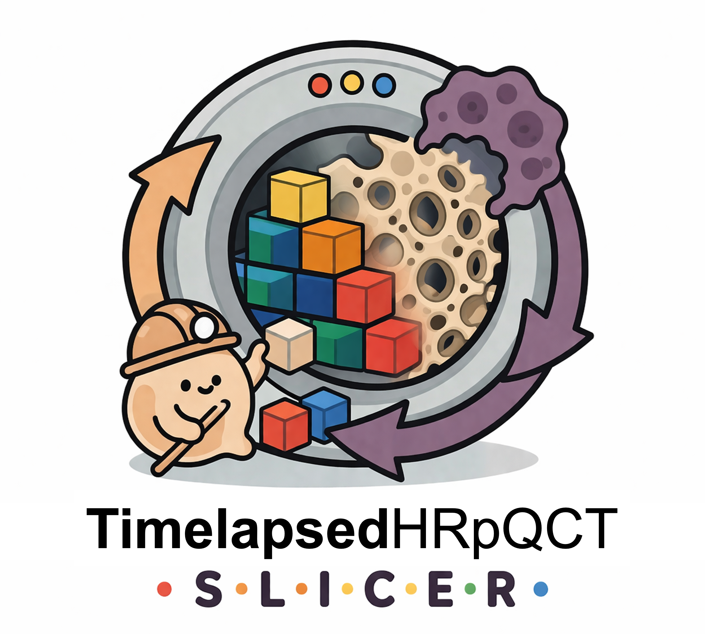

<p align="center">
  
</p>

# TimelapsedHRpQCT Slicer Extension

3D Slicer scripted extension for running and reviewing the `timelapsed-hrpqct` pipeline.

## Core Pipeline Repository

This Slicer extension is a GUI wrapper around the main pipeline repository:

- `TimelapsedHRpQCT`: https://github.com/wallematthias/TimelapsedHRpQCT

## Features

- Dataset parse with session table and clear error guidance.
- One-click pipeline actions:
  - `Run Full`
  - `Run Masks`
  - `Run Timelapse`
  - `Run + Multistack`
  - `Run Analysis` (analysis rerun with updated parameters)
- Smart reuse of existing outputs (import, masks, registration, analysis) through pipeline skip logic.
- Processed data loading for:
  - `raw`
  - `transformed`
  - `remodelling image`
- Segmentation-aware loading and remodelling 3D preview controls.
- In-module dependency install/update button for `timelapsed-hrpqct`.

## Exposed Settings

### Mask generation

- Method: `adaptive` or `global`
- Lower threshold
- Higher threshold
- Raw ingest mode:
  - default: keep raw files in place
  - optional: copy raw files (`--copy-raw-inputs`)
  - optional: restructure raw files (`--restructure-raw`)

### Registration

- Metric: `mattes` or `correlation`
- Sampling percentage (timelapse + multistack correction)
- Number of resolutions (timelapse + multistack correction)
- Number of iterations (timelapse + multistack correction)

### Analysis

- Threshold
- Cluster size

## Installation (Developer Mode)

Use this flow until the extension appears in the Slicer Extensions Manager.

1. Open Slicer.
2. Go to `Edit -> Application Settings -> Modules`.
3. Add module path:
   - `<repo>/TimelapsedHRpQCTSlicer/TimelapsedHRpQCT`
4. Restart Slicer.
5. Open module `TimelapsedHRpQCT`.
6. In the module, click `Install / Update timelapsed-hrpqct`.
7. Select your AIM dataset root and click `Parse input`.
8. Run `Run Full` (or run specific stages).

## Runtime Dependency

The module installs/updates `timelapsed-hrpqct` inside Slicer Python using the built-in button.

## Expected Data Parsing Format

The parser expects AIM filenames that include:

- subject identifier
- site token (`DR`, `DT`, or `KN`)
- session token (for example `T1`, `T2`, `C1`, `BL`, `FL`, `FL1`)
- optional stack token for multistack data (`STACK01`, `STACK_01`, `STACK-01`)
- optional mask roles (`TRAB_MASK`, `CORT_MASK`, `FULL_MASK`, `REGMASK`, `ROI1`, `ROI2`, ...)

Examples:

```text
SUBJ001_DR_T1.AIM
SUBJ001_DR_T1_TRAB_MASK.AIM
SUBJ001_DR_T1_CORT_MASK.AIM
SUBJ001_DR_T2.AIM

SUBJ010_DT_STACK01_T1.AIM
SUBJ010_DT_STACK01_T1_TRAB_MASK.AIM
SUBJ010_DT_STACK02_T1.AIM
SUBJ010_DT_STACK02_T1_CORT_MASK.AIM

SAMPLE355_KN_BL.AIM
SAMPLE355_KN_FL1.AIM
SAMPLE355_KN_FL1_REGMASK.AIM
SAMPLE355_KN_FL1_ROI1.AIM
```

If site or stack tokens are missing, the parser uses defaults from the pipeline config where possible, but explicit naming is strongly recommended.

Notes:

- Input discovery is recursive, so flat folders and nested BIDS/MIDS-style trees are both supported.
- Parse supports generic and sided sites (`radius/tibia/knee` and `*_left/*_right` variants).
- `Restructure raw inputs` is disabled when parse-table label overrides are active, because overrides run through a virtual input root.

## License

MIT
